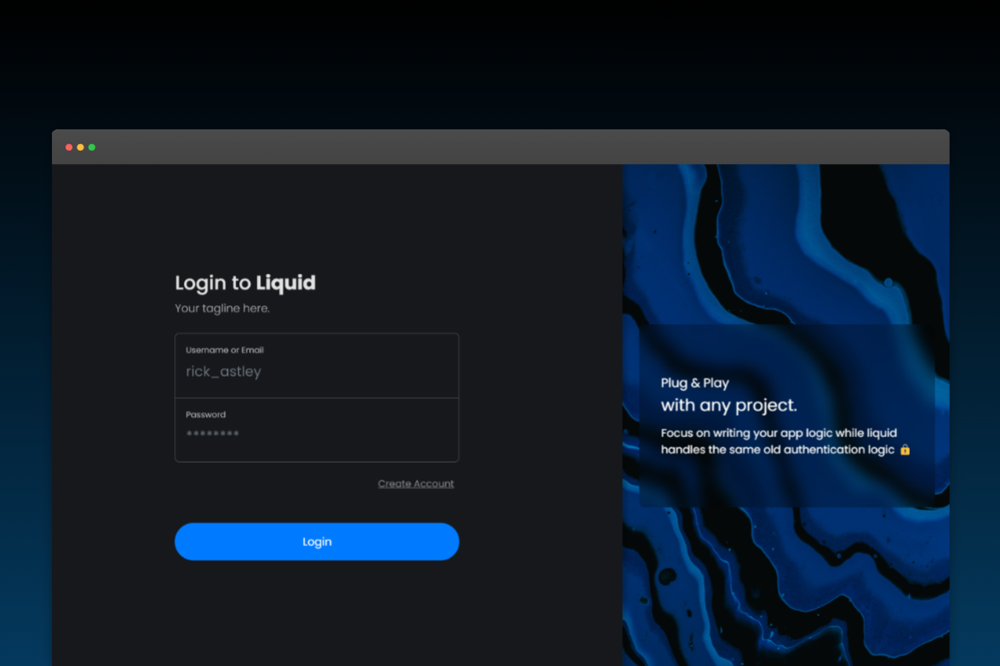

# Node JS OAuth2 Server

Open source TypeScript implementation of [oauthjs/node-oauth2-server](https://github.com/oauthjs/node-oauth2-server) using Mongo DB with user sign up and login✨


### Setup

1. Run `npm i`.
2. Copy and rename file `src/public/app-config.sample.json` to `config.json` and replace with your strings.
3. You can override parameters like MongoDB connection string by using the env name present in `src/service/configuration/options.json`.
4. Create the following client record in the `clients` colelction:

```
{
  "_id": {
    "$oid": "633972976aaa0ba6952f86db"
  },
  "id": "application_client",
  "grants": [
    "client_credentials",
    "authorization_code",
    "refresh_token"
  ],
  "redirectUris": [
    "your_frontend_uri"
  ],
  "secret": "your_secret"
}
```
5. Start the server using command `npm run start:dev`. Your service should be running on https://localhost:3000.

### User Sign Up:

1. POST `/user/create`

```
{
    "username": "your_username",
    "firstName": "John",
    "lastName": "Doe",
    "email": "johndoe@example.com",
    "password": "password"
}
```
2. If you are running this on dev mode, a code is printed in your console. Copy this.
3. GET `/user/verify-email?code=code_from_step3`. Now the user should be active.

### User Login:

1. To login, visit `/login`.
2. Enter your username and password. Submit.
3. If the credentials are correct, the application redirects to your client's reditect URI with the state and code.
4. In your application logic, you can use this code in exchange for an access and refresh token using the `authorization_code` grant.